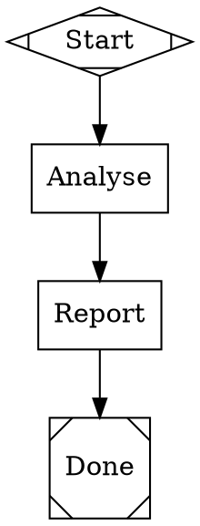

# Attractor

**Attractor** is a DOT-based AI workflow pipeline runner. You define multi-stage AI workflows as directed graphs using Graphviz DOT syntax — nodes are tasks, edges are transitions — and the execution engine traverses the graph, calling an LLM agent at each stage.

## Packages

| Package | Description |
|---------|-------------|
| [`packages/llm`](./packages/llm) | Unified multi-provider LLM client (Anthropic, OpenRouter) |
| [`packages/agent`](./packages/agent) | Programmable coding agent loop with tool execution |
| [`packages/attractor`](./packages/attractor) | Pipeline execution engine, DOT parser, history recorder |
| [`packages/attractor-mcp`](./packages/attractor-mcp) | MCP server for Attractor |

## Specs

The design intent for this stack lives in [`attractor-spec/`](./attractor-spec/):

| Spec | Purpose |
|------|---------|
| [`attractor-spec.md`](./attractor-spec/attractor-spec.md) | DOT DSL schema, pipeline execution engine, node handlers, conditions, linting |
| [`coding-agent-loop-spec.md`](./attractor-spec/coding-agent-loop-spec.md) | Coding agent loop, tools, event system, execution environment abstraction |
| [`unified-llm-spec.md`](./attractor-spec/unified-llm-spec.md) | Unified LLM client, streaming, tool calling, retry/error handling |

---

## Pipelines

Pipelines live in [`pipelines/`](./pipelines/) as `.mts` files. Each is a self-contained TypeScript module you run directly with `tsx`.

### Quick start

```bash
# 1. Set your OpenRouter API key
set -a && source .env && set +a

# 2. Run a pipeline
npx tsx pipelines/example.mts
```

### Included pipelines

| File | What it does |
|------|-------------|
| [`pipelines/example.mts`](./pipelines/example.mts) | Minimal two-stage template — copy this to build new pipelines |
| [`pipelines/test-and-fix.mts`](./pipelines/test-and-fix.mts) | Build → test → diagnose → fix → verify loop for the Attractor test suite |

---

## How pipelines work

### 1 — Define the graph

A pipeline is a `digraph` in Graphviz DOT syntax. Each `box` node is an agent task; `Mdiamond` is the start; `Msquare` is exit.



### 2 — Conditional routing

Edges can carry `condition` and `weight` attributes. The engine evaluates conditions at runtime and picks the highest-weight matching edge.

```dot
test -> exit     [label="Passed", condition="outcome=success",  weight=10]
test -> diagnose [label="Failed", condition="outcome!=success"]
```

### 3 — Goal gates and retries

Mark a node `goal_gate=true` to assert it must succeed before the pipeline can exit. Set `max_retries` on a node or `default_max_retry` on the graph to enable automatic retry with exponential back-off.

```dot
graph [default_max_retry=2]

verify [shape=box, goal_gate=true,
        prompt="Run the test suite. All tests must pass."]
```

### 4 — Node attribute reference

| Attribute | Type | Description |
|-----------|------|-------------|
| `shape` | string | `box` = agent task, `Mdiamond` = start, `Msquare` = exit, `diamond` = conditional, `hexagon` = human gate, `component` = parallel fan-out, `tripleoctagon` = fan-in, `parallelogram` = tool, `house` = manager loop |
| `label` | string | Display name shown in logs and history |
| `prompt` | string | Instruction sent to the agent for this stage |
| `max_retries` | number | Extra attempts before the stage fails (0 = no retry) |
| `goal_gate` | boolean | Pipeline cannot exit until this stage has succeeded |
| `retry_target` | string | Node ID to jump to on failure instead of aborting |
| `llm_model` | string | Override the default model for this stage |
| `allow_partial` | boolean | Accept `partial_success` when retries are exhausted |
| `timeout` | Duration | Abort the stage after this duration (`30s`, `5m`, `2h`) |

### 5 — Graph attribute reference

| Attribute | Type | Description |
|-----------|------|-------------|
| `goal` | string | Human-readable description of the pipeline's objective |
| `label` | string | Pipeline display name |
| `default_max_retry` | number | Retry budget for every node that doesn't set its own |
| `retry_target` | string | Global fallback node to jump to on any unrouted failure |

---

## Writing a pipeline file

Copy [`pipelines/example.mts`](./pipelines/example.mts) and update:

1. **The `digraph`** — stages, prompts, and edges.
2. **`logs_root`** — where per-run stage logs (prompts + responses) are written.
3. **`PipelineRecorder` path** — where `runs.jsonl` history is appended.
4. **`model`** — any OpenRouter model ID (e.g. `anthropic/claude-opus-4-6`, `moonshotai/kimi-k2.5`).

Minimal shell:

```typescript
import { Runner, PipelineRecorder } from '../packages/attractor/src/index.js'
import { fileURLToPath } from 'node:url'
import { dirname, join } from 'node:path'

const __dirname = dirname(fileURLToPath(import.meta.url))
const ROOT = join(__dirname, '.')

const API_KEY = process.env['OPENROUTER_API_KEY']
if (!API_KEY) { console.error('Set OPENROUTER_API_KEY'); process.exit(1) }

const dot = `digraph MyPipeline {
  graph [goal="..."]
  start [shape=Mdiamond, label="Start"]
  exit  [shape=Msquare,  label="Done"]
  step  [shape=box, label="Step", prompt="Do the thing."]
  start -> step -> exit
}`

const recorder = new PipelineRecorder(join(ROOT, 'pipeline-output/my-pipeline/history'))

const runner = new Runner({
  api_key:           API_KEY,
  model:             'moonshotai/kimi-k2.5',
  working_directory: ROOT,
  on_event:          recorder.handler,
})

const outcome = await runner.run(dot, {
  logs_root: join(ROOT, 'pipeline-output/my-pipeline/run-logs'),
})
console.log('Outcome:', outcome.status)
```

---

## History and observability

`PipelineRecorder` writes one JSON line per run to `runs.jsonl`. Each record includes:

- `run_id`, `name`, `goal`, `status`, `started_at`, `completed_at`, `duration_ms`
- `model`, `provider`, `trigger`
- `total_tool_calls`, `total_llm_calls`, `total_retries`
- `tokens_input`, `tokens_output`, `tokens_total`, `estimated_cost_usd`
- `tool_breakdown` — per-tool call counts rolled up across all stages
- `stages` — per-stage breakdown of all the above

Stage logs (prompts + agent responses) are written to `logs_root/<stage_id>/`.

---

## Development

```bash
# Install dependencies
npm install

# Build all packages
npm run build --workspaces --if-present

# Run tests
npx vitest run

# Run a single package's tests
npx vitest run --project packages/attractor
```

## Terminology

- **NLSpec** — Natural Language Spec: a human-readable spec intended to be directly usable by coding agents to implement or validate behavior.
- **Attractor** — the DOT-based pipeline runner defined in this repository.
- **Stage** — a single node execution within a pipeline run.
- **Goal gate** — a node that must have succeeded before the pipeline is allowed to reach the exit node.
