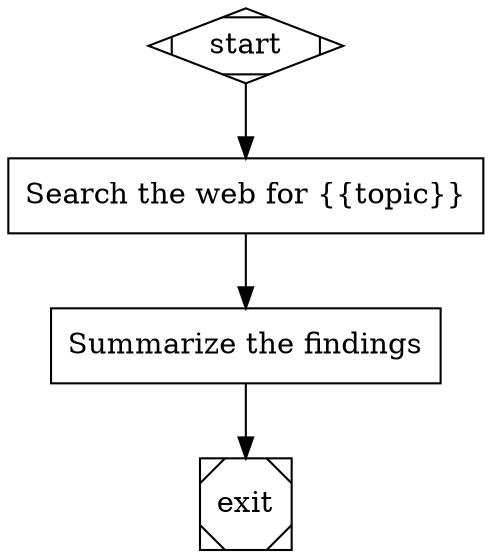

# Attractor

A DOT-based AI pipeline runner. Define pipelines as Graphviz graphs; each node is an AI task (LLM call, tool execution, human gate, etc.). Runs are logged to SQLite and viewable in a web dashboard.

## Requirements

- Go 1.24+
- `OPENROUTER_API_KEY` environment variable

## Setup

```sh
cp .env.example .env
# add your OPENROUTER_API_KEY to .env

go build -o attractor ./cmd/attractor/
```

## Usage

### Run a pipeline

```sh
./attractor run examples/simple_research.dot
./attractor run examples/simple_research.dot --model openai/gpt-4o
./attractor run examples/simple_research.dot --json   # full JSON run log
```

### Manage pipelines

```sh
./attractor pipeline add examples/simple_research.dot --name "research"
./attractor pipeline list
./attractor pipeline delete <id>
```

### Web dashboard

```sh
./attractor serve              # opens http://localhost:8080
./attractor serve --port 9000
```

### List available models

```sh
./attractor models
```

## Writing pipelines

Pipelines are [Graphviz DOT](https://graphviz.org/doc/info/lang.html) files. Each node's shape determines its type:

| Shape | Type | Description |
|---|---|---|
| `Mdiamond` | start | Entry point |
| `Msquare` | exit | Exit point |
| `box` | codergen | LLM call |
| `diamond` | conditional | Routing node |
| `hexagon` | wait.human | Human approval gate |
| `parallelogram` | tool | Shell command (`tool_command` attr) |
| `component` | parallel | Fan-out |
| `tripleoctagon` | parallel.fan_in | Fan-in |
| `house` | stack.manager_loop | Sprint orchestration loop |

Example:



See [`examples/`](./examples) for more.

## Configuration

All config via environment variables (or `.env`):

| Variable | Default | Description |
|---|---|---|
| `OPENROUTER_API_KEY` | — | Required for LLM calls |
| `ATTRACTOR_MODEL` | `openai/gpt-4o` | Default model |
| `ATTRACTOR_DB_PATH` | `~/.attractor/attractor.db` | SQLite database path |
| `ATTRACTOR_LOGS_DIR` | `~/.attractor/logs` | Per-run log files |
| `ATTRACTOR_WEB_HOST` | `localhost` | Dashboard listen host |
| `ATTRACTOR_WEB_PORT` | `8080` | Dashboard listen port |

## Using with OpenCode

Create `.opencode/commands/` in the project root to invoke Attractor from within an OpenCode session via slash commands.

**`.opencode/commands/attractor-run.md`**
```markdown
---
description: Run an Attractor pipeline and analyze the results
---
!`./attractor run $ARGUMENTS 2>&1`
```

**`.opencode/commands/attractor-run-json.md`**
```markdown
---
description: Run an Attractor pipeline and analyze the JSON run log
---
!`./attractor run $ARGUMENTS --json 2>&1`
```

**`.opencode/commands/attractor-pipelines.md`**
```markdown
---
description: List all registered Attractor pipelines
---
!`./attractor pipeline list 2>&1`
```

Then use them inside OpenCode:

```
/attractor-run examples/simple_research.dot
/attractor-run examples/code_review.dot --model anthropic/claude-3-5-sonnet
/attractor-pipelines
```

The shell output is injected into the LLM prompt automatically, so you can ask follow-up questions about the results.

## Specs

- [Attractor Specification](./attractor-spec.md)
- [Coding Agent Loop Specification](./coding-agent-loop-spec.md)
- [Unified LLM Client Specification](./unified-llm-spec.md)

## Terminology

- **NLSpec** (Natural Language Spec): a human-readable spec intended to be directly usable by coding agents to implement/validate behavior.
